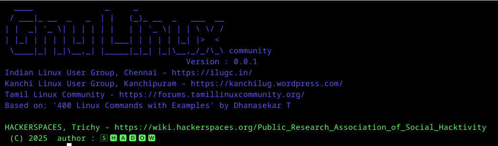

# glc

### Tamil Linux Community (tlc)

### Gnu/Linux Community (glc)


It acts like a man command, making tools easy to understand and use for anyone. 
This includes lots of example commands, detailed explanations of how each works, and full, documented instructions.


### What I'm doing:

I'm creating a simple help command, similar to the man (manual) pages you see for other commands on Linux/Unix systems. This will provide quick and easy-to-read documentation for a linux and custom command/script I've developed.


### Why I'm doing it:

    Easy Reference: Instead of digging through a long script or a separate document, you'll be able to quickly get an overview of what the command does, its options, and how to use it.

    Consistency: It mimics a familiar system (man pages), making it intuitive for anyone used to the Linux/Unix environment.

    Self-Documentation: It's a way to ensure that the purpose and usage of the command are clear and readily available to anyone who uses it, including myself in the future!
    
    Shareability: If I share this command with others, they'll have built-in instructions on how to use it effectively.
    
    
    
### How to use:

```
git clone https://github.com/Tpj-root/glc.git
cd glc
bash start.sh

```





```
nano -c main.sh 
goto line no : 20

## Enabled or Disable
Title_screen=1 # 1 means enabled, 0 means disabled
```


Man pages are only available if the correct package is installed.

For example: man curl works only if curl is installed.

But our glc help command is always available.

glc curl — shows you how to install and use curl.


---

### ✅ 1. **Directory structure (recommended):**

Put your help files in a folder like `~/glc/`:

```
~/glc/
├── apt-file_notes.txt
├── crunch_notes.txt
├── curl_notes.txt
```


---

### ✅ 2. **Usage:**

```bash
glc apt-file

```

---

### ✅ 3. **Create new help file:**

Just create a new file like:

```bash
nano glc/nmap_notes.txt

```

And you're done. No need to edit the function.


Now available: Help notes for nmap are accessible on your system.

```
cnc@debian:~$ glc 
apt-file  crunch    curl      nmap

cnc@debian:~$ man nmap 
No manual entry for nmap

cnc@debian:~$ glc nmap 


✅ This command gives you helpful guidance on installing and using nmap — even if the man page is missing.

```


### How it helps you:


The glc command provides usage instructions, install steps, and examples — even when man pages are not available. It’s a quick reference guide right in your terminal.


